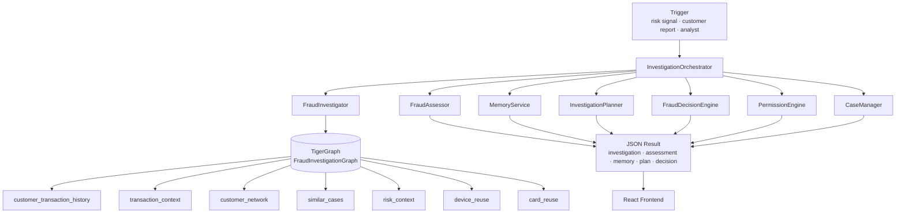

<div align="center">

# 🔍 Agentic Fraud Investigation

### AI-powered fraud investigation & next-best-action on TigerGraph

**Team dejavu** · TigerGraph Agentic Fraud Investigation Hackathon (HHGOA)

[](https://www.tigergraph.com/)
[](https://www.python.org/)
[](https://fastapi.tiangolo.com/)
[](https://react.dev/)
[](https://www.typescriptlang.org/)

*Investigate fraud autonomously. Traverse the graph. Score the risk. Recommend the action.*

</div>

---

## 📖 Table of Contents

- [What is this?](#-what-is-this)
- [Key features](#-key-features)
- [How it works](#-how-it-works)
- [Architecture](#-architecture)
- [Tech stack](#-tech-stack)
- [Graph schema](#-graph-schema)
- [GSQL queries](#-gsql-queries)
- [Repository layout](#-repository-layout)
- [Setup](#-setup)
- [Running the agent](#-running-the-agent)
- [Benchmark results](#-benchmark-results)
- [Design notes](#-design-notes)
- [Known limitations](#-known-limitations)
- [Submission artifacts](#-submission-artifacts)
- [Team](#-team)

---

## 🎯 What is this?

An **AI agent that autonomously investigates fraud**. Given a fraud signal (risk score, customer report, or analyst trigger), it:

1. Queries **TigerGraph** for transaction history, connected entities, and historical case precedent
2. **Assesses** risk, uncertainty, and likely fraud pattern
3. **Retrieves memory** — similar past cases for precedent
4. **Recommends a next-best action** under a policy/approval framework
5. Produces a **complete case record** with a full audit trail

Built on the **HHGOA_IEEE** dataset: **590,000+ transactions**, **13,500+ customers**, 7 vertex types, 7 edge types in TigerGraph Savanna.

---

## ✨ Key features

| | Feature | Description |
|---|---|---|
| 🧠 | **Agentic pipeline** | 14-step orchestrator: investigate → assess → plan → decide → explain |
| 🕸️ | **Graph-native evidence** | 7 GSQL queries traverse the fraud knowledge graph |
| 🎯 | **Deterministic risk scoring** | No black-box — every score has an evidence trail |
| 🔒 | **Policy-gated actions** | Auto-execute, require-approval, or forbidden |
| 📚 | **Historical memory** | Retrieves precedent cases by pattern, customer, and card |
| 💬 | **Explainability** | Why the decision was made, what's uncertain, what's missing |
| ⚡ | **FastAPI backend** | Single POST endpoint, structured JSON response |
| 🖥️ | **React frontend** | Analyst dashboard for cases, evidence, graph, actions |

---

## 🔄 How it works



**The 14-step orchestrator in short:**

1. Investigate customer via graph
2. Create case
3. Store evidence
4. Store findings
5. Initial assessment
6. Build memory-search case from patterns
7. Retrieve historical memory
8. Final assessment with memory
9. Update case risk level
10. Build investigation plan
11. Generate decision
12. Apply policy / permission
13. Store authorized decision
14. Return complete result

---

## 🏗️ Architecture

```
User / Trigger
    │
    ▼
FastAPI  ──►  POST /investigations/customer
    │
    ▼
InvestigationOrchestrator
    │
    ├──►  FraudInvestigator  ──►  TigerGraph queries
    ├──►  FraudAssessor          (risk, uncertainty, patterns)
    ├──►  MemoryService          (historical case retrieval)
    ├──►  InvestigationPlanner
    ├──►  FraudDecisionEngine    (next-best action)
    ├──►  PermissionEngine       (policy + approval)
    └──►  CaseManager            (case record, audit)
    │
    ▼
Structured JSON  ──►  React Frontend
```

---

## 🛠️ Tech stack

| Layer | Technology |
|---|---|
| **Graph database** | TigerGraph Savanna (Cloud) |
| **Graph queries** | GSQL |
| **Backend** | Python 3.11 · FastAPI · pyTigerGraph |
| **Frontend** | React · TypeScript · Vite |
| **Agent** | Custom Python orchestrator |
| **Dataset** | HHGOA_IEEE (IEEE-CIS Fraud Detection, Vesta Corp.) |

---

## 🕸️ Graph schema

**7 vertex types**

```
Customer  ·  Transaction  ·  Card  ·  Identity  ·  Device  ·  FraudCase  ·  HistoricalCase
```

**7 edge types**

```
Customer        ──CustomerMakesTransaction──────►  Transaction
Transaction     ──TransactionUsesCard───────────►  Card
Transaction     ──TransactionHasIdentity────────►  Identity
Transaction     ──TransactionUsesDevice─────────►  Device
FraudCase       ──FraudCaseFlagsTransaction─────►  Transaction
FraudCase       ──FraudCaseInvolvesCustomer─────►  Customer
HistoricalCase  ──HistoricalCaseInvolvesCustomer─► Customer
```

---

## 🔎 GSQL queries

| Query | Input | Returns |
|---|---|---|
| `customer_transaction_history_v2` | `VERTEX<Customer>` | All transactions for a customer |
| `transaction_context` | `VERTEX<Transaction>` | Card, identity, device attached to a transaction |
| `customer_network` | `VERTEX<Customer>` | Co-customers connected via shared card or device |
| `similar_cases` | `VERTEX<Customer>` | Own historical cases + same-pattern matches |
| `risk_context` | `VERTEX<Customer>` | High/medium risk counts, distinct device/card footprint |
| `device_reuse` | `VERTEX<Customer>` | Worldwide transaction counts for the customer's devices |
| `card_reuse` | `VERTEX<Customer>` | Worldwide transaction counts for the customer's cards |

All queries are called from Python via `tools/tigergraph_client.py`:

```python
c.run_query("customer_transaction_history_v2", params={"customer": ("C06075",)})
```

---

## 📁 Repository layout

```
.
├── 🧠 agent/                 # Agent pipeline
│   ├── investigator.py       # Graph evidence collection
│   ├── assessor.py           # Risk + uncertainty assessment
│   ├── planner.py            # Investigation planning
│   ├── decision.py           # Next-best-action
│   └── orchestrator.py       # 14-step end-to-end flow
│
├── 🚀 api/                   # FastAPI backend
│   ├── main.py
│   ├── routes/               # investigations · cases · actions · transactions · benchmark
│   └── schemas/
│
├── 📂 cases/                 # Case manager (in-memory)
├── 🧩 memory/                # Historical case retrieval
├── 🔐 policy/                # Permission engine + approval manager
│
├── 🔌 tools/
│   └── tigergraph_client.py  # TG connection wrapper
│
├── 🕸️ graph/                 # GSQL sources
│   ├── schema/               # Vertex + edge definitions
│   └── queries/              # All 7 GSQL queries
│
├── 💾 data/processed/        # Pre-processed CSVs
│
├── 🛠️ scripts/               # Setup + benchmark + submission scripts
│
├── 📊 benchmark_outputs/     # 20 case JSONs + _summary.json
├── 📤 submission/            # Formatted case files + all_cases.json
├── 🖥️ frontend/              # React + TypeScript + Vite UI
└── 📝 docs/                  # Blog post, architecture notes
```

---

## ⚙️ Setup

### Prerequisites

- **Python** 3.11+
- **Node.js** 18+
- **TigerGraph** Savanna instance (or Community Edition) with graph `FraudInvestigationGraph` and an API token

### 1. Clone

```bash
git clone https://github.com/<your-user>/-Agentic-Fraud-Investigation.git
cd -- -Agentic-Fraud-Investigation
```

### 2. Python environment

```bash
python -m venv venv
source venv/bin/activate       # Windows: venv\Scripts\activate
pip install -r requirements.txt
```

### 3. Environment variables

Copy `.env.example` → `.env`:

```env
TIGERGRAPH_HOST=https://your-instance.i.tgcloud.io
TIGERGRAPH_GRAPH=FraudInvestigationGraph
TIGERGRAPH_SECRET=...
TIGERGRAPH_TOKEN=...
```

> ⚠️ Never commit `.env`. It's already in `.gitignore`.

### 4. Verify connection

```bash
python -c "from tools.tigergraph_client import get_tigergraph_client; c=get_tigergraph_client(); c.connect(); print(c.run_query('test_connection'))"
```

Expected: `[{'TigerGraph connection works': 'TigerGraph connection works'}]`

### 5. Load the graph

```bash
python -m scripts.recreate_graph        # drop + reinstall schema
python -m scripts.load_data             # load all vertex CSVs
python -m scripts.load_edges_only       # load all edge CSVs
```

Expected vertex counts:

| Vertex | Rows |
|---|---:|
| Customer | 13,553 |
| Transaction | 590,742 |
| Card | 14,893 |
| Identity | 144,432 |
| Device | 1,942 |
| FraudCase | 20 |
| HistoricalCase | 5,565 |

### 6. Install GSQL queries

```bash
python -m scripts.install_and_enable graph/queries/transaction_history.gsql
python -m scripts.install_and_enable graph/queries/transaction_context.gsql
python -m scripts.install_and_enable graph/queries/customer_network.gsql
python -m scripts.install_and_enable graph/queries/similar_cases.gsql
python -m scripts.install_and_enable graph/queries/risk_context.gsql
python -m scripts.install_and_enable graph/queries/device_reuse.gsql
python -m scripts.install_and_enable graph/queries/card_reuse.gsql
```

### 7. Start the backend

```bash
python -m uvicorn api.main:app --reload --port 8000
```

API docs → http://127.0.0.1:8000/docs

### 8. Start the frontend

```bash
cd frontend
npm install
npm run dev
```

Open http://localhost:5173

---

## ▶️ Running the agent

### Single investigation (Python)

```bash
python -c "from agent.orchestrator import InvestigationOrchestrator; import json; r = InvestigationOrchestrator().investigate_customer('C06075', limit=50); print(json.dumps(r, indent=2, default=str))"
```

### Single investigation (API)

```bash
curl -X POST http://127.0.0.1:8000/investigations/customer \
     -H "Content-Type: application/json" \
     -d '{"customer_id": "C06075", "limit": 50}'
```

### All 20 benchmark cases

```bash
python -m scripts.run_benchmark
```

Outputs → `benchmark_outputs/` (20 JSONs + `_summary.json`).

### Format submission artifacts

```bash
python -m scripts.format_submission
```

Outputs → `submission/` (20 Markdown case files + `all_cases.json`).

---

## 📊 Benchmark results

**20 cases** evaluated end-to-end.

> ✅ 15 flagged **high** / **very_high** · ⚪ 3 **low** · 🟡 1 **moderate** · 20/20 completed

| Case | Customer | Risk | Score | Recommended Action |
|---|---|---|---:|---|
| `HHG-001` | `C12382` | 🔴 high | 0.84 | `request_customer_validation` |
| `HHG-002` | `C11891` | 🟢 low | 0.00 | `allow_transaction` |
| `HHG-003` | `C08623` | 🔴 high | 0.94 | `request_customer_validation` |
| `HHG-004` | `C08106` | 🔴 high | 0.83 | `request_customer_validation` |
| `HHG-005` | `C02923` | 🔴 high | 0.88 | `request_customer_validation` |
| `HHG-006` | `C07297` | 🟢 low | 0.00 | `allow_transaction` |
| `HHG-007` | `C09933` | 🟣 very_high | 0.98 | `request_customer_validation` |
| `HHG-008` | `C13171` | 🟣 very_high | 0.95 | `request_customer_validation` |
| `HHG-009` | `C08299` | 🔴 high | 0.85 | `request_customer_validation` |
| `HHG-010` | `C10434` | 🔴 high | 0.93 | `request_customer_validation` |
| `HHG-011` | `C11923` | 🟣 very_high | 0.97 | `request_customer_validation` |
| `HHG-012` | `C05876` | 🔴 high | 0.91 | `request_customer_validation` |
| `HHG-013` | `C07671` | 🔴 high | 0.89 | `request_customer_validation` |
| `HHG-014` | `C13487` | 🟢 low | 0.00 | `allow_transaction` |
| `HHG-015` | `C03042` | 🔴 high | 0.87 | `request_customer_validation` |
| `HHG-016` | `C09988` | 🟡 moderate | 0.00 | `request_customer_validation` |
| `HHG-017` | `C04570` | 🔴 high | 0.91 | `request_customer_validation` |
| `HHG-018` | `C02354` | 🔴 high | 0.94 | `request_customer_validation` |
| `HHG-019` | `C07987` | 🔴 high | 0.94 | `request_customer_validation` |
| `HHG-020` | `C12265` | 🔴 high | 0.86 | `request_customer_validation` |

📂 Full records → [`benchmark_outputs/`](benchmark_outputs/) · 📄 Case files → [`submission/`](submission/)

---

## 🧭 Design notes

<details>
<summary><b>Deterministic-first</b></summary>

Every decision, risk score, and explanation is computed from graph evidence. No LLM is required for correctness.
</details>

<details>
<summary><b>LLM is optional</b></summary>

A local Qwen3 4B model via Ollama is wired as an explainer, but the deterministic explanation is the reliable fallback. The LLM is never allowed to invent evidence or make a fraud decision.
</details>

<details>
<summary><b>Policy-gated actions</b></summary>

`PermissionEngine` classifies each recommended action as auto-execute, require-approval, or forbidden. Nothing reaches "execution" without passing policy.
</details>

<details>
<summary><b>Audit trail</b></summary>

Every case stores evidence, findings, decisions, and actions in order. `CaseManager` is the source of truth.
</details>

<details>
<summary><b>Historical memory</b></summary>

`MemoryService` matches new cases against closed cases by pattern, customer, and card overlap. Precedent informs the recommendation.
</details>

---

## ⚠️ Known limitations

- **No reverse-edge traversal** — the graph's edges lack `WITH REVERSE_EDGE`, so queries that need reverse hops use forward-only traversal + `IN @@set` filters.
- **No primary-id attribute access** — `primary_id_as_attribute="true"` is missing on the installed `Transaction` vertex, so GSQL bodies compare vertex variables directly (`WHERE c2 != customer`).
- **Device signals are weak** — IEEE dataset device fingerprints are generic user-agent strings. Thousands of customers share common mobile/desktop fingerprints. Card collisions are far more discriminative.
- **Card-id format mismatch** — `FraudCase.card_id` and `HistoricalCase.card_id` use different formats, so direct joins don't work. Pattern matching is the working join.

---

## 📤 Submission artifacts

| Artifact | Location |
|---|---|
| Case files (Markdown) | [`submission/`](submission/) |
| Raw agent output | [`benchmark_outputs/`](benchmark_outputs/) |
| Blog post | [`docs/blog.md`](docs/blog.md) |
| Demo video | *link in submission form* |
| Social post | *link in submission form* |

---

## 👥 Team

**Team dejavu** · TigerGraph Agentic Fraud Investigation Hackathon (HHGOA)

---

<div align="center">

*Built on TigerGraph. Powered by graph traversal. Explained by evidence.*

</div>
